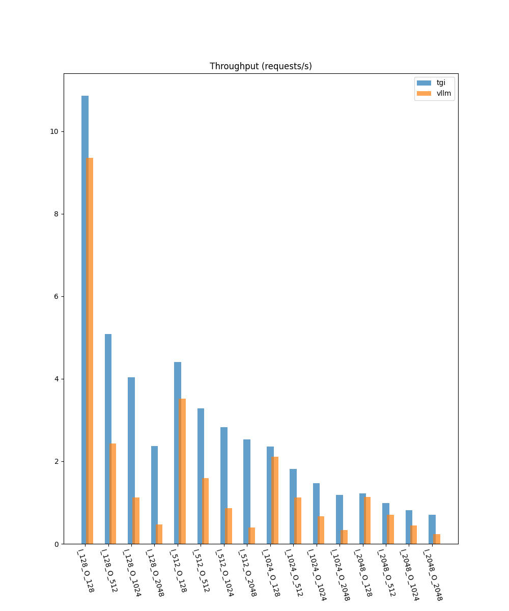
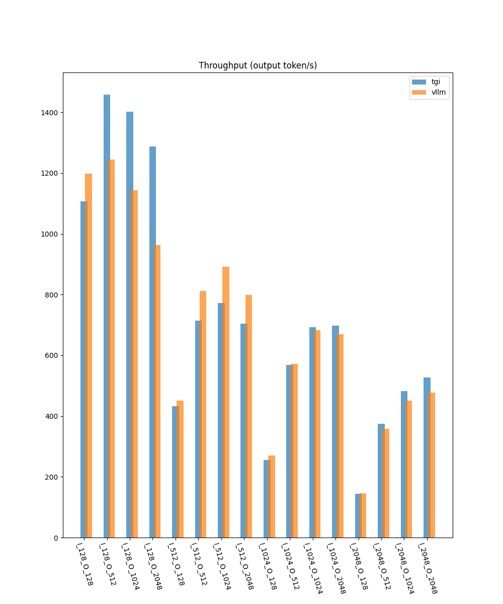
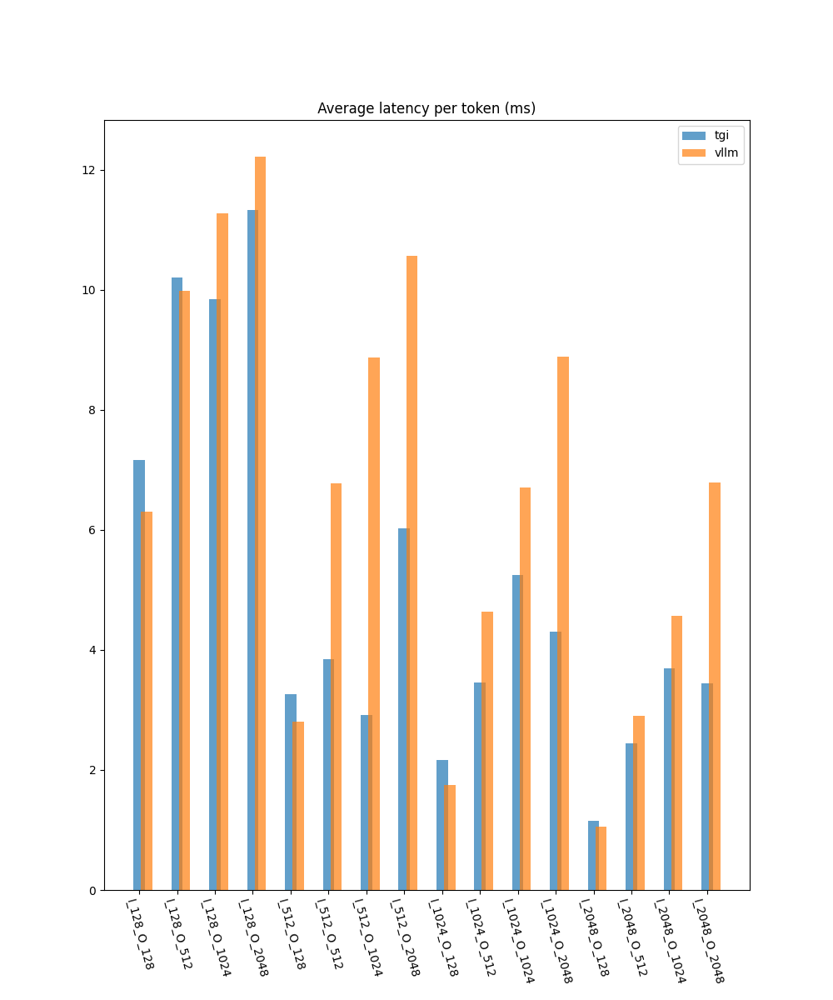
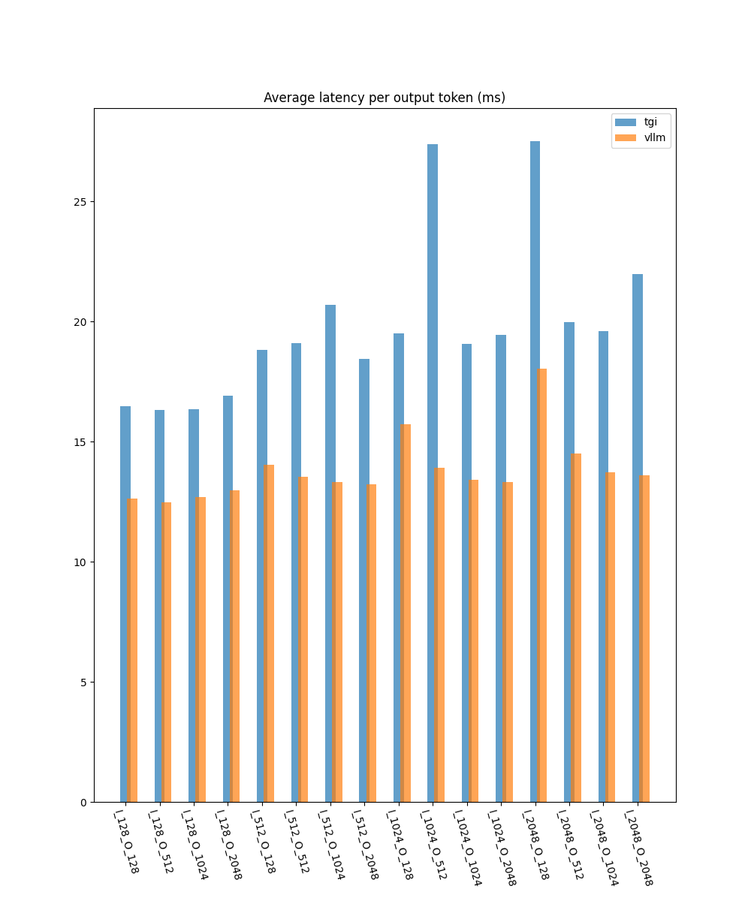

# Mistral-7B-OpenOrca-AWQ

## A100 40G

## vllm v0.2.5

| Input Length | Output Length | Throughput (requests/s) | Throughput (output token/s) | Average latency per token (ms) | Average latency per output token (ms) |
| :----------: | :-----------: | :---------------------: | :-------------------------: | :----------------------------: | :-----------------------------------: |
|     128      |      128      |          9.36           |           1197.56           |              6.31              |                 12.62                 |
|     128      |      512      |          2.43           |           1245.15           |              9.98              |                 12.48                 |
|     128      |     1024      |          1.12           |           1144.08           |             11.27              |                 12.68                 |
|     128      |     2048      |          0.47           |           962.78            |             12.22              |                 12.98                 |
|     512      |      128      |          3.52           |           450.55            |              2.81              |                 14.03                 |
|     512      |      512      |          1.59           |           812.33            |              6.77              |                 13.55                 |
|     512      |     1024      |          0.87           |           891.85            |              8.88              |                 13.31                 |
|     512      |     2048      |          0.39           |           798.45            |             10.57              |                 13.21                 |
|     1024     |      128      |          2.11           |           270.68            |              1.75              |                 15.72                 |
|     1024     |      512      |          1.12           |           571.98            |              4.64              |                 13.91                 |
|     1024     |     1024      |          0.67           |           683.30            |              6.71              |                 13.41                 |
|     1024     |     2048      |          0.33           |           669.71            |              8.89              |                 13.33                 |
|     2048     |      128      |          1.14           |           145.33            |              1.06              |                 18.04                 |
|     2048     |      512      |          0.70           |           358.76            |              2.90              |                 14.51                 |
|     2048     |     1024      |          0.44           |           450.81            |              4.57              |                 13.72                 |
|     2048     |     2048      |          0.23           |           478.05            |              6.79              |                 13.59                 |

## tgi v1.3.4

| Input Length | Output Length | Throughput (requests/s) | Throughput (output token/s) | Average latency per token (ms) | Average latency per output token (ms) |
| :----------: | :-----------: | :---------------------: | :-------------------------: | :----------------------------: | :-----------------------------------: |
|     128      |      128      |          10.86          |           1107.30           |              7.16              |                 16.47                 |
|     128      |      512      |          5.09           |           1458.52           |             10.20              |                 16.32                 |
|     128      |     1024      |          4.03           |           1402.37           |              9.85              |                 16.34                 |
|     128      |     2048      |          2.37           |           1287.54           |             11.33              |                 16.90                 |
|     512      |      128      |          4.40           |           432.17            |              3.27              |                 18.83                 |
|     512      |      512      |          3.28           |           714.87            |              3.84              |                 19.11                 |
|     512      |     1024      |          2.82           |           772.32            |              2.92              |                 20.69                 |
|     512      |     2048      |          2.53           |           703.89            |              6.02              |                 18.45                 |
|     1024     |      128      |          2.36           |           255.23            |              2.17              |                 19.50                 |
|     1024     |      512      |          1.82           |           568.31            |              3.46              |                 27.38                 |
|     1024     |     1024      |          1.47           |           693.07            |              5.25              |                 19.08                 |
|     1024     |     2048      |          1.19           |           697.36            |              4.30              |                 19.43                 |
|     2048     |      128      |          1.22           |           143.47            |              1.15              |                 27.51                 |
|     2048     |      512      |          0.99           |           374.50            |              2.45              |                 19.99                 |
|     2048     |     1024      |          0.82           |           481.78            |              3.69              |                 19.60                 |
|     2048     |     2048      |          0.70           |           527.28            |              3.44              |                 21.99                 |

## Throughput (Requests/s)

## Throughput (Output Token/s)

## Average Latency Per token/(ms)

## Average Latency Per Output Token(ms)
